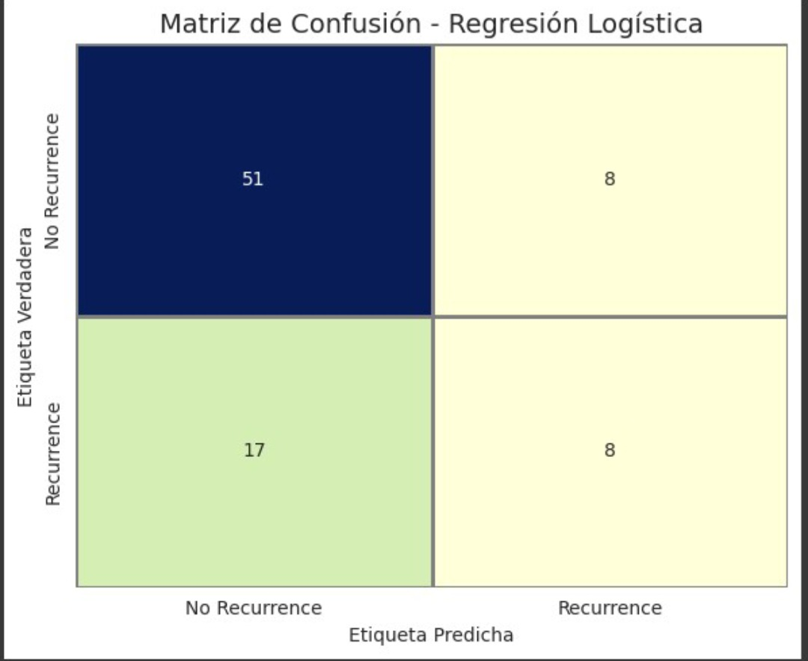
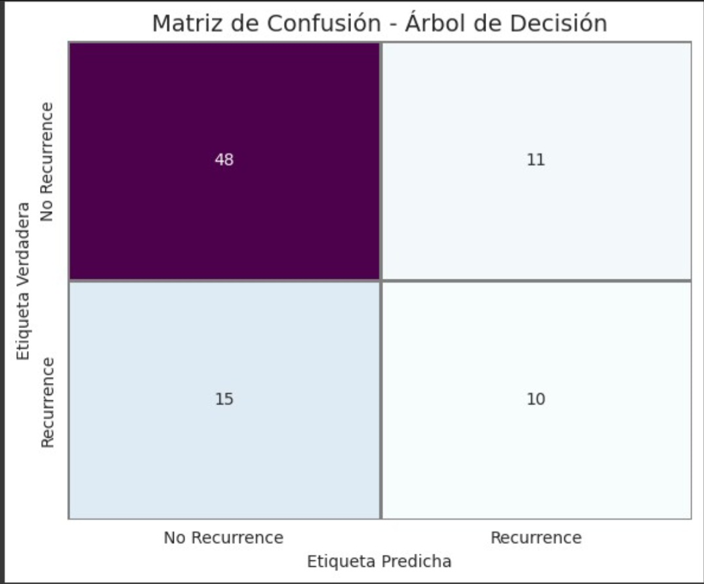

# Diagnóstico de Recurrencia del Cáncer de Mama mediante Aprendizaje Automático

Este repositorio presenta un proyecto completo de predicción de recurrencia del cáncer de mama usando modelos de aprendizaje automático supervisado. Fue desarrollado como proyecto final en el curso de Aprendizaje Automático de la Universidad Autónoma de Occidente, con base en el conjunto de datos Breast Cancer de UCI.

---

## Institución
**Facultad de Ingeniería – Universidad Autónoma de Occidente**

**Asignatura:** Aprendizaje Automático  
**Proyecto Final:** Diagnóstico de Recurrencia del Cáncer de Mama mediante ML  

**Autores:**  
- Juan Fernando Aldana – 2201173  
- Marco Antonio Acosta – 2190289  
- Juan Camilo León – 2190612  
- Santiago Cortés Murcia – 2190365  
- Julian David Velasquez Patiño – 2205142  
- Edilmer Chachinoy Narváez – 22501262

---

## Resumen del Proyecto

El cáncer de mama es una de las enfermedades más comunes entre las mujeres a nivel mundial. Este estudio aplica modelos de aprendizaje automático supervisado para predecir la **recurrencia** de cáncer de mama utilizando datos clínicos categóricos del repositorio **UCI Breast Cancer Dataset**. Los modelos evaluados incluyen:

- Regresión Logística
- Árboles de Decisión
- Máquinas de Vectores de Soporte (SVM con kernel RBF)

---

## Dataset

- 286 registros de pacientes
- 9 atributos categóricos y ordinales
- Variable objetivo: recurrencia/no recurrencia
- Fuente: [UCI ML Repository](https://archive.ics.uci.edu/dataset/14/breast+cancer)

---

## Preprocesamiento de Datos

- **Codificación:**
  - Binaria: `LabelEncoder` (node-caps, breast, irradiat, clase)
  - Nominal: `OneHotEncoder` (edad, menopausia, tamaño tumor, inv-nodes, cuadrante)
  - Ordinal: `LabelEncoder` (deg-malig)

- **Manejo de faltantes:** eliminación de registros incompletos
- **Escalado:** `RobustScaler` (resistente a valores atípicos)
- **División:** 70% entrenamiento / 30% test (estratificada)

---

## ⚙️ Modelos y Evaluación

| Modelo                | Accuracy | Precisión | Recall | F1-Score |
|----------------------|----------|-----------|--------|----------|
| Regresión Logística  | 70.2%    | 50%       | 32%    | 0.39     |
| Árbol de Decisión    | 69.0%    | 48%       | 40%    | 0.44     |
| SVM (RBF kernel)     | 72.6%    | 60%       | 24%    | 0.34     |


## Matrices de Confusión
### Regresión Logística

### Árbol de Decisión

### SVM


---

## Análisis y Conclusiones

- El **modelo SVM** obtuvo mayor precisión general, pero baja sensibilidad (detectó pocos casos reales).
- El **Árbol de Decisión** mostró el mejor balance entre recall y precisión.
- La **Regresión Logística**, aunque simple e interpretable, tuvo el peor desempeño en recall.
- Todos los modelos predijeron mejor la clase "no recurrencia", mostrando sesgo por el desbalance de datos.
- Se recomienda aplicar técnicas de **reescalado**, **resampling (SMOTE)** o modelos **ensemble** para mejorar resultados.
---
## Estructura del Repositorio

```
├── Proyecto_aprendizaje_automatico.ipynb    # Notebook principal
├── README.md                                # Este documento
├── requirements.txt                         # Librerías necesarias
├── img/                                     # Imágenes para visualizaciones
```

---

## Requisitos

```bash
pip install pandas matplotlib seaborn ucimlrepo scikit-learn
```

---

## Referencias

1. Setlik et al. (2014). *American Journal of Cancer Research*  
2. Duo et al. (2023). *BMC Medical Informatics and Decision Making*  
3. UCI ML Repository – Breast Cancer  
4. Scikit-learn documentation – RobustScaler  
5. SAS Blog (2024): Comparación entre Regresión Logística y Árboles de Decisión

---

## Licencia

Uso académico sin fines comerciales.
