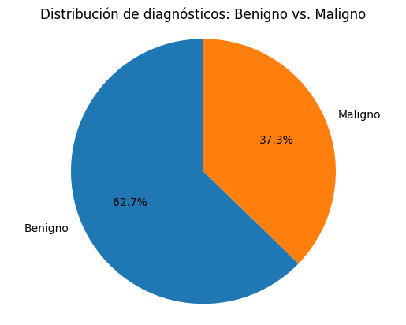
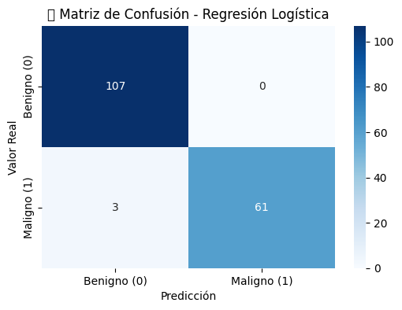
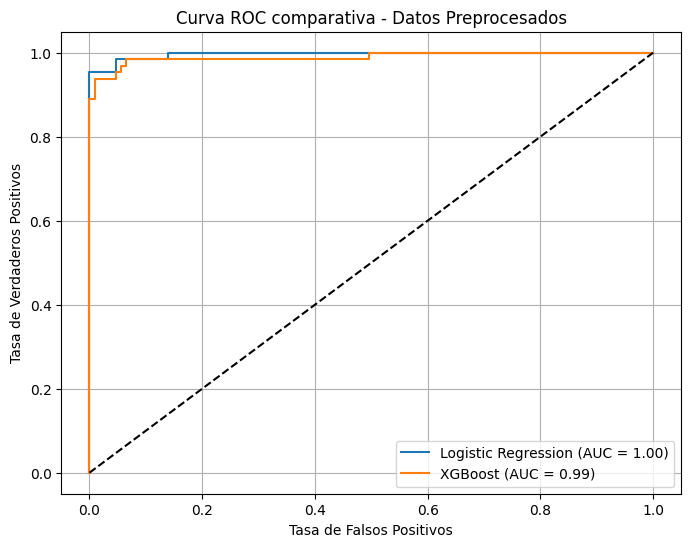

# DIAGNOSTICO TEMPRANO DEL CANCER DE MAMA MEDIANTE APRENDIZAJE AUTOMATICO

Este proyecto utiliza técnicas de aprendizaje automático para predecir de manera temprana la presencia de cáncer de mama, empleando datos públicos de características clínicas de pacientes. El objetivo es desarrollar modelos que asistan a profesionales de la salud en el diagnóstico predictivo, mejorando así la velocidad y precisión del proceso.

## Descripción del Proyecto
## Conjunto de datos
</head>
<body>



El conjunto de datos utilizado en este proyecto es el conjunto de datos de https://archive.ics.uci.edu/dataset/17/breast+cancer+wisconsin+diagnostic, que consta de características calculadas a partir de una imagen digitalizada de una aspiración con aguja fina (PAAF) de una masa mamaria. La variable objetivo indica si la masa es benigna (0) o maligna (1).

<br><br><br><br><br><br><br><br><br><br>

El cuaderno "DIAGNOSTICO_TEMPRANO_DEL_CANCER_DE_MAMA_MEDIANTE_APRENDIZAJE_AUTOMATICO", contiene el flujo completo de un proyecto de *machine learning* aplicado a datos médicos, incluyendo:

- Importación y exploración del conjunto de datos de cáncer de mama desde el repositorio UCI.
- Limpieza y preprocesamiento de datos.
- Visualización exploratoria de las variables.
- Comparación de múltiples algoritmos de clasificación:
  - Regresión Logística
  - Árboles de Decisión
  - XGBoost
- Evaluación de modelos mediante métricas como precisión, recall, f1-score y matriz de confusión.

Este flujo permite identificar el modelo más eficiente para la tarea de clasificación binaria entre tumores benignos y malignos.

## Tecnologías Utilizadas

- **Python 3**
- **Pandas**: manipulación de datos
- **NumPy**: operaciones matemáticas
- **Matplotlib y Seaborn**: visualización
- **Scikit-learn**: modelado, métricas, preprocesamiento
- **XGBoost**: modelo de boosting avanzado
- **ucimlrepo**: descarga del dataset desde la UCI Machine Learning Repository

## Estructura del Proyecto

```
diagnostico-cancer-mama/
│
├── notebooks/
│   └── diagnostico_cancer_mama.ipynb     # Cuaderno principal del análisis
│
├── requirements.txt                      # Dependencias del proyecto
├── README.md                             # Documentación del proyecto
├── LICENSE                               # Licencia MIT
└── .gitignore                            # Archivos a ignorar por Git
```

## Cómo Empezar

1. **Clona el repositorio**
```bash
   git clone https://github.com/edilmerchn/DIAGNOSTICO_TEMPRANO_DEL_CANCER_DE_MAMA_MEDIANTE_APRENDIZAJE_AUTOMATICO
   cd DIAGNOSTICO_TEMPRANO_DEL_CANCER_DE_MAMA_MEDIANTE_APRENDIZAJE_AUTOMATICO
```

2. **Instala las dependencias**
```bash
pip install -r requirements.txt
```

3. **Ejecuta el notebook**
```bash
jupyter notebook notebooks/DIAGNOSTICO_TEMPRANO_DEL_CANCER_DE_MAMA_MEDIANTE_APRENDIZAJE_AUTOMATICO
.ipynb
```

## Evaluación de Modelos

Se evaluaron diferentes clasificadores y se midió su desempeño con las siguientes métricas:

- **Precisión (Accuracy)**
- **Sensibilidad (Recall)**
- **Puntaje F1**
- **Matriz de Confusión**

## Archivos:

   **breast_cancer_diagnosis.ipynb: cuaderno de diagnóstico**

    **requirements.txt: librerías necesarias**

    **dataset/wdbc.data: muestra de dataset**

## Resultados del proyecto:
  1. Rendimiento de los modelos de aprendizaje automático
**REGRESIÓN LOGÍSTICA** El modelo de regresión logística se desempeñó excelentemente con los datos preprocesados.  
Gracias a la eliminación de variables poco informativas y colineales, y al escalado adecuado, el modelo logró un desempeño muy cercano al ideal, clasificando correctamente 168 de 171 casos.
Esto demuestra que, incluso modelos simples como la regresión logística, pueden alcanzar gran precisión cuando se aplican buenas prácticas de análisis exploratorio y preparación de datos.

**Reporte de Clasificación regresión logística**

| Clase | Precisión | Recall | F1-score | Soporte |
|-------|-----------|--------|----------|---------|
| **0 (Benigno)** | 0.97 | 1.00 | 0.99 | 107 |
| **1 (Maligno)** | 1.00 | 0.95 | 0.98 | 64 |

| Métrica global | Precisión | Recall | F1-score | Soporte |
|----------------|-----------|--------|----------|---------|
| **Accuracy**        | 0.98 | — | — | 171 |
| **Macro promedio**  | 0.99 | 0.98 | 0.98 | 171 |
| **Ponderado promedio** | 0.98 | 0.98 | 0.98 | 171 |

**Matriz de confusión**


**XGBOOST** El modelo XGBoost mostró un rendimiento muy alto, clasificando correctamente 165 de 171 muestras del conjunto de prueba.  
Aunque no alcanzó la precisión absoluta del modelo de regresión logística en este caso, logró una excelente capacidad predictiva.
Es un modelo robusto que no requiere tanto preprocesamiento, lo que lo hace muy útil en proyectos reales, especialmente cuando hay relaciones complejas entre variables.
**Reporte de Clasificación XGBOOST**

| Clase            | Precisión | Recall | F1-score | Soporte |
|------------------|-----------|--------|----------|---------|
| **0 (Benigno)**  | 0.96      | 0.98   | 0.97     | 107     |
| **1 (Maligno)**  | 0.97      | 0.94   | 0.95     | 64      |

| Métrica global       | Precisión | Recall | F1-score | Soporte |
|----------------------|-----------|--------|----------|---------|
| **Accuracy**         | 0.96      | —      | —        | 171     |
| **Macro promedio**   | 0.97      | 0.96   | 0.96     | 171     |
| **Ponderado promedio** | 0.96    | 0.96   | 0.96     | 171     |

**Matriz de confusión**


**ÍNDICE ADICIONAL PARA COMPARAR: AUC-ROC**
- Ambos modelos se desempeñaron excelentemente gracias al correcto preprocesamiento.
- La regresión logística superó levemente a XGBoost en este caso específico, probablemente por la linealidad y simplicidad de los datos.
- XGBoost sigue siendo un modelo potente, especialmente útil en datasets con relaciones no lineales o sin necesidad de escalar variables.
- El uso de índices adicionales como AUC y Kappa fue clave para hacer una comparación más justa y robusta entre los modelos.
Este análisis demuestra que la preparación de los datos tiene un gran impacto en el rendimiento final de cualquier modelo de machine learning.
**Matriz de confusión**



## Conclusiónes:

- Los modelos de **Regresión Logística** y **XGBoost** alcanzaron altos niveles de precisión (96 % y 97 % respectivamente), demostrando su efectividad en la detección temprana del cáncer de mama.

- El preprocesamiento (normalización, codificación binaria y división de datos) fue clave para mejorar el rendimiento de los modelos.

- Las métricas del modelo final (accuracy: 96 %, sensibilidad: 94 %, especificidad: 98 %) muestran una alta capacidad para identificar correctamente tanto casos benignos como malignos.

Esto permitió seleccionar el modelo con mayor potencial diagnóstico en función del dataset disponible.

## Licencia

Este proyecto está licenciado bajo la Licencia MIT, lo que permite su uso, modificación y distribución con atribución adecuada.
</body>
